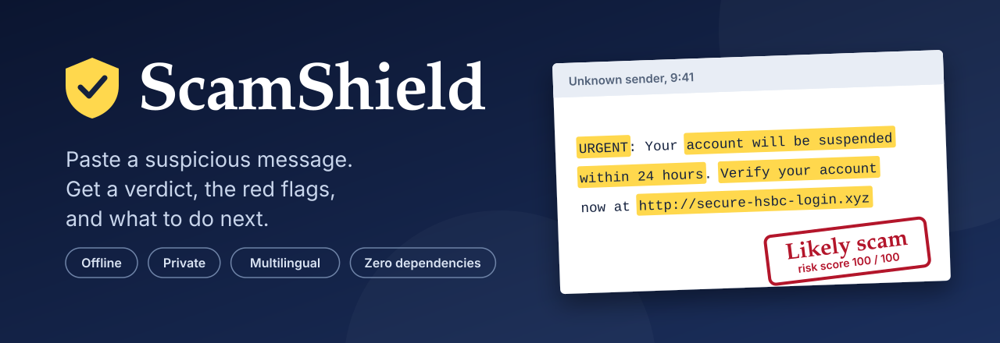
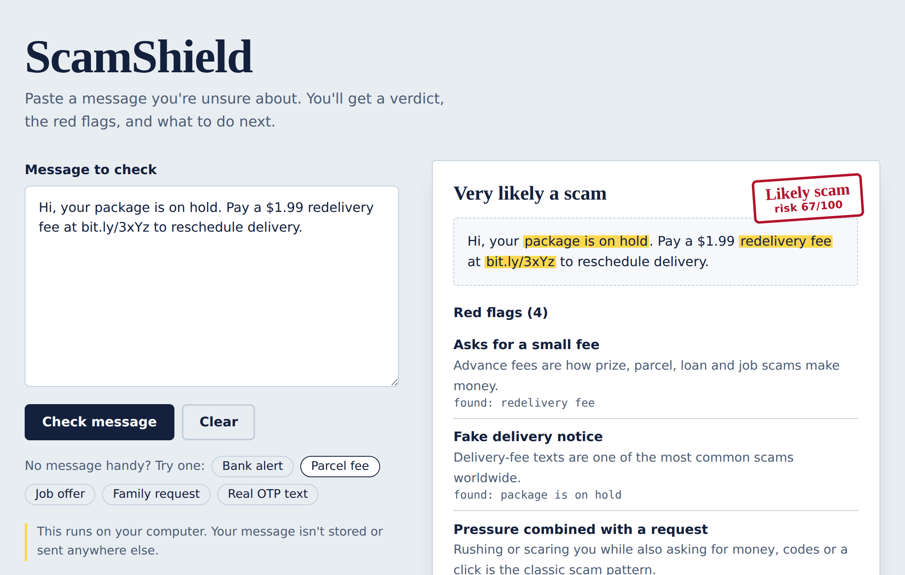
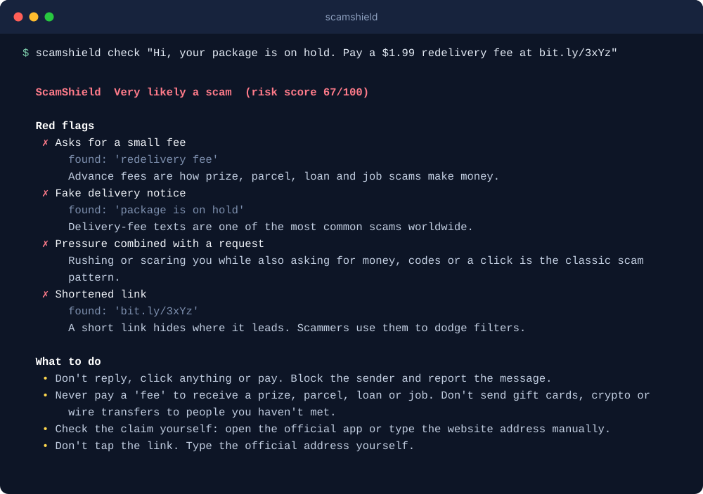
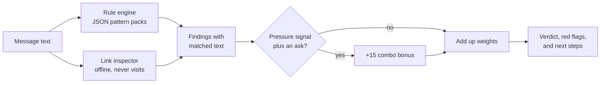

<div align="center">



<br>

[](https://github.com/YOUR_USERNAME/scamshield/actions/workflows/ci.yml)
[](LICENSE)
[](https://www.python.org/)
[](pyproject.toml)
[](CONTRIBUTING.md)

**An offline, private scam-message checker for the people scammers target most.**

[Quick start](#quick-start) · [How it works](#how-it-works) · [JSON API](#json-api) · [Add a scam pattern](#add-a-scam-pattern) · [Roadmap](#roadmap)

</div>

---

## Why this exists

Fake bank alerts, delivery-fee texts, "you've won" messages, and too-good-to-be-true job offers cost people billions every year. The people hit hardest are often older adults and people who don't read English as a first language, and they rarely have anyone to ask *"is this real?"* in the moment.

ScamShield is a small tool that answers that question in plain language:

- **A verdict:** very likely a scam, suspicious, or no obvious red flags.
- **The evidence:** the exact words and links that triggered each warning, highlighted in the message.
- **A next step:** what to do, in one or two sentences.

And it does this **without sending the message anywhere**.

<div align="center">

</div>

## Highlights

| | |
|---|---|
| **Private by design** | Runs on your machine, standard library only. No accounts, no analytics, no cloud calls. The server never logs message content. |
| **Explains itself** | Every warning shows the matched text and a plain-language reason. No black-box score. |
| **Link forensics** | Detects shorteners, lookalike spellings (`paypa1.com`), brand names on the wrong site, hidden `user@host` tricks, raw IPs, punycode and throwaway endings. Links are inspected, never visited. |
| **Multilingual** | English and Spanish are the most complete. Hindi, Tamil and Sinhala are starter packs that need native-speaker review (see below). |
| **Easy to extend** | Scam patterns are plain JSON. Contributing a rule needs no code, and every rule must ship examples that the test suite checks. |
| **Three ways to use it** | A command line tool, a local web page, and a JSON API. Also importable as a Python library. |

## Quick start

Requires Python 3.9 or newer. There is nothing else to install.

```bash
git clone https://github.com/YOUR_USERNAME/scamshield.git
cd scamshield
pip install -e .
```

**Check a message from the terminal**

```bash
scamshield check "Hi, your package is on hold. Pay a \$1.99 redelivery fee at bit.ly/3xYz"
```

<div align="center">

</div>

**Open the web interface**

```bash
scamshield serve            # then visit http://127.0.0.1:8765
```

**Use it from Python**

```python
from scamshield import analyze

report = analyze("URGENT: verify your account at http://secure-hsbc-login.xyz")
print(report.verdict, report.score)      # likely_scam 100
for flag in report.findings:
    print(flag.title, "->", flag.evidence)
```

**Use it in scripts.** `scamshield check` exits with `0` (low risk), `1` (suspicious) or `2` (likely scam), and `--json` gives machine-readable output:

```bash
pbpaste | scamshield check --json
```

## How it works



1. **Rules.** Each rule is a category (urgency, threat, prize, credentials, payment, impersonation, and so on), a weight, a few regular expressions, and a plain-language explanation. A rule counts once per message.
2. **Links.** Every URL is checked for shape-based warning signs such as shorteners, lookalike spellings, brand names on someone else's domain, and hidden destinations.
3. **Combination.** A *pressure* signal (deadline, threat, prize) together with an *ask* (money, a code, a risky link) is the classic scam recipe, so it adds a bonus.
4. **Reassurance.** Genuine one-time-code texts usually include anti-fraud wording. That lowers the score slightly. It never proves a message is real.
5. **Verdict.** The weights are summed and capped at 100.

| Score | Verdict |
|---|---|
| 55 to 100 | Very likely a scam |
| 25 to 54 | Looks suspicious |
| 0 to 24 | No obvious red flags (never "safe") |

## JSON API

`scamshield serve` also exposes a small API. It binds to `127.0.0.1` by default.

```bash
curl -s http://127.0.0.1:8765/api/analyze \
  -H "Content-Type: application/json" \
  -d '{"text": "Congratulations! You have won the lottery. Pay the processing fee."}'
```

```jsonc
{
  "score": 65,
  "verdict": "likely_scam",
  "headline": "Very likely a scam",
  "findings": [
    {
      "rule_id": "prize.en.won",
      "category": "prize",
      "weight": 25,
      "title": "Unexpected prize or winnings",
      "explanation": "You can't win a contest you never entered.",
      "evidence": "You have won",
      "start": 17,      // character offsets into your text, for highlighting
      "end": 29,
      "lang": "en"
    }
    // ...
  ],
  "advice": ["Don't reply, click anything or pay. Block the sender and report the message."],
  "script": "latin"
}
```

| Endpoint | Method | Purpose |
|---|---|---|
| `/api/analyze` | `POST` | Body `{"text": "..."}` (max 64 KB). Returns the report above. |
| `/health` | `GET` | Status, version and number of loaded rules. |
| `/` | `GET` | The web interface. |

## Add a scam pattern

You don't need to write code. Add a rule to [`src/scamshield/data/patterns.json`](src/scamshield/data/patterns.json), or try it privately first with your own pack:

```json
{
  "id": "payment.en.fee",
  "category": "payment",
  "lang": "en",
  "weight": 25,
  "title": "Asks for a small fee",
  "explain": "Advance fees are how prize, parcel, loan and job scams make money.",
  "patterns": ["\\b(processing|customs|redelivery) (fee|charge)s?\\b"],
  "examples": ["Pay a $1.99 redelivery fee"]
}
```

```bash
scamshield check --patterns my-pack.json "text to test"
python -m unittest discover -s tests -v     # every rule's examples must fire
```

The full guide, including how to choose weights, is in [CONTRIBUTING.md](CONTRIBUTING.md).

## Languages

| Language | Status |
|---|---|
| English | Most complete |
| Spanish | Good coverage of the common patterns |
| Hindi, Tamil, Sinhala | **Starter packs.** Written without native-speaker review. Treat results as a bonus signal and please help improve them. |

Link checks work in every language, because the structure of a web address doesn't depend on the message's language.

## Privacy and security

- Messages are analysed in memory and never written to disk or logged.
- The web server listens on localhost only unless you pass `--host`. If you expose it to a network, put it behind your own authentication.
- The web page loads no third-party scripts, fonts or trackers, and is served with a strict Content-Security-Policy.
- Input is capped at 10,000 characters and API bodies at 64 KB.

## Limitations

ScamShield is a helper, not a guarantee.

- It uses rules, not understanding. A well-written scam with no known red flags will pass, and an odd but genuine message can be flagged.
- "No obvious red flags" never means "safe". When money, codes or personal details are involved, confirm through the official app, website or phone number.
- It checks the *shape* of a link, not what is behind it, because it never visits links.
- Obfuscation tricks such as spaced-out letters aren't handled yet.

If you've already shared a code or sent money, contact your bank right away.

## Roadmap

- [ ] Telegram and WhatsApp bot wrappers (self-hosted)
- [ ] Optional small on-device classifier to complement the rules
- [ ] Text normalisation to defeat obfuscation (`fr33`, spaced letters, look-alike Unicode)
- [ ] Reviewed Hindi, Tamil and Sinhala packs, then Arabic, Portuguese, Swahili and more
- [ ] Anonymised community scam-pattern feed
- [ ] Browser extension and share-sheet integration for phones
- [ ] Screenshot input (offline OCR)

## Project layout

```
scamshield/
├── src/scamshield/
│   ├── engine.py        # scoring, verdicts, advice
│   ├── urls.py          # link extraction and inspection
│   ├── cli.py           # `scamshield` command
│   ├── server.py        # local web server + JSON API (stdlib only)
│   ├── data/patterns.json
│   └── web/             # the web interface
├── data/example-pack.json
├── tests/
├── scripts/make_assets.py   # regenerates the README images
└── .github/workflows/ci.yml
```

## Contributing

Pattern contributions, especially in languages beyond English, are the most valuable thing you can add. Start with [CONTRIBUTING.md](CONTRIBUTING.md).

## License

[MIT](LICENSE). Use it, fork it, build on it, and help protect someone.
